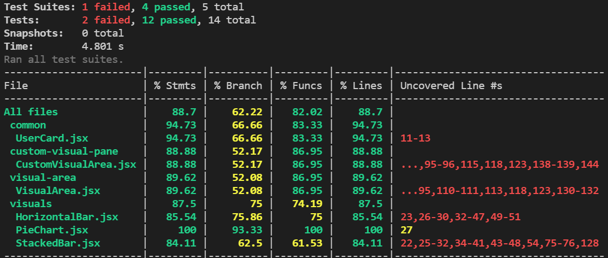

# Bot Milestone

## Bot Platform Implementation

Our Bot platform has been implemented using React and JavaScript to create the User Interface which is where the user can interact with the Bot.

## Use Case Refinement 
_________________
### 1. Viewing the visualizations prepared by the bot.
____________

1.1 Preconditions

The user needs to have valid credentials to login to the GitHub platform. He must have at least one active repository. 

1.2 Main Flow

This use case begins with the user navigating to our website. The user authenticates with her github credentials [S1]. The user is now on the landing page. On the landing page the user sees a large canvas with the default visualization and several controls to change the visualization and its input data. The user has the following control based actions available:

1] Use tab controls to switch between predefined visuals.[S2] 

2] Using a dropdown to cycle between periods for the data in the visual. [S3]

3] Dropdown to change the current repository.

1.3 Subflows

S1 Check Credentials: 

If the user is not already github authenticated they are prompted to enter their credentials. Using Github SSO. If the user has an existing session with github, the token is reused.

S2 Visual Switching:

The user has 4 different buttons (tabs) marked that the user clicks to display different visuals.

Tab 1 (default) - Pie chart visual showing number of issues completed by the contributor.

Tab 2 - Horizontal clustered bar graph denoting (total bugs, bugs open, bugs closed) for each milestone.

Tab 3 - A stacked column bar graph showing a number of different types of issues (documentation,testing,feature,bugs,etc) for each milestone.

Tab 4 - A carousel of cards showing all contributors, contributions(tasks completed), tasks pending, Pull requests raised and Pull requests reviewed.

S3 Time Intervals: 

The user has 4 different time intervals they can choose from:

- Two-week interval (1-15th, 15th-end of the month)
- Month interval (current month)
- Quarter interval (current quarter)
- Year interval (current year)

Changing the value will update the input data of the visuals.

1.4 Alternative flows:

[E1] User's login fails and she is re-prompted to enter correct credentials
______
### 2. Creating and viewing custom visuals.
____________

2.1 Preconditions

The user needs to have valid credentials to login to the GitHub platform. He must have at least one active repository. 

2.2 Main Flow

This use case begins with the user navigating to our website. The user authenticates with her github credentials [S1]. The user is now on the landing page. On the left side of the landing page , the user sees a panel that contains several controls to generate a custom visual.

1] The first control selects the type of visual. Allowed types are (pie chart, bar chart ,line graph).

2] The second dropdown allows the user to select a dimension for the visual. Available dimensions:

-User

-Pull requests

-Issue

3] Depending on which dimension is selected, the user can select from several measures from a third dropdown.

Example: Users: issue count, pull request count, pull request review count, bug count.

4] User will see a button to generate the visual.

**Each control will be disabled until the previous one is filled.**

5] User now can click on the button to save the visual.

Note : The main flow describes how the user chooses a visual based on the parameters available. Clicking on the "generate" button will display the visual on the right side of the page and clicking on the button "save" will save the visual.

2.3 Subflows

S1 Check Credentials: 

If the user is not already github authenticated they are prompted to enter their credentials. Using Github SSO. If the user has an existing session with github, the token is reused.

2.4 Alternative flows:

[E1] User's login fails and she is re-prompted to enter correct credentials.
______________________
### 3. Viewing and Editing an existing saved visual.
________________________

3.1 Preconditions

The user needs to have valid credentials to login to the GitHub platform. He must have at least one active repository. The user should have some visuals that are saved. 

3.2 Main Flow

This use case begins with the user navigating to our website. The user authenticates with her github credentials [S1]. The user is now on the landing page. On the left side of the landing page , the user sees a panel with an option to view an existing visual. 

The user also sees a button "load" to load that particular visual. After loading the visual the user can edit it by following the flow as in use case 2, the only difference being that the dropdown is pre-populated with the visuals' originally selected parameters.

3.3 Subflows

S1 Check Credentials: 

If the user is not already github authenticated they are prompted to enter their credentials. Using Github SSO. If the user has an existing session with github, the token is reused.

3.4 Alternative flows:

[E1] User's login fails and she is re-prompted to enter correct credentials.
________________
### 4. Creating and Viewing Snapshots.
_______________________

#### **Snapshot:** By taking a snapshot we mean to save a read- only record of the current visual and it's data, that can be retrieved for future reference.
(This is similar to taking a screenshot)

4.1 Preconditions

The user needs to have valid credentials to login to the GitHub platform. He must have at least one active repository. 

4.2 Main Flow

This use case begins with the user navigating to our website. The user authenticates with their github credentials [S1]. The user is now on the landing page. The user clicks the "snapshot" button to save the current visual and it's data which is visible on the canvas.

The user has a dropdown feature available to her from which she can select a snapshot to view. By selecting the snapshot and clicking on the load button.

Once the visual has loaded in the canvas, the button changes to "unload" and all the other controls are disabled. Clicking the unload button removes the snapshot and the canvas returns to its original state before the snapshot was loaded. In this way the user can select different snapshots to load.

4.3 Subflows

S1 Check Credentials: 

If the user is not already github authenticated they are prompted to enter their credentials. Using Github SSO. If the user has an existing session with github, the token is reused.

4.4 Alternative flows:

[E1] User's login fails and she is re-prompted to enter correct credentials.

## Testing

Running npx c8 npm test and seeing testing coverage -

## Mocking Infrastructure

Mocking of the API service call has been implemented in App.test.jsx. 
