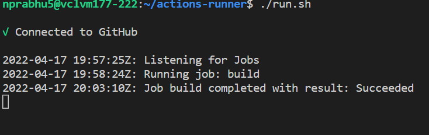

# Deployment Milestone

Given that our deployment is on Azure, we decided to move forward with GitHub Actions as the deployment service instead of Ansible, as Ansible has limited support for Azure. The setup is similar to Ansible, in that we define a YAML file with the configuration of the pipeline. We also used our VCL instance to configure a "runner" that executes the pipeline each time there's a push to `main` branch.

## Deployment Scripts

The main.yml file contains the steps for deployment. Comments have been added to understand the script. The file is linked below: 

[Link to main.yml](.github/workflows/main.yml)

Run the file *run.sh* using ./run.sh command. You will see something similar to what is shown below: 

Any push to the `main` branch will automatically run the deployment scripts.

## Acceptance Testing

You can view our bot through this link to our website https://janetprod.azurewebsites.net/. 

### **Use Case 1: Viewing the visualizations prepared by the bot**
______________________________________________________________________
**Preconditions**

The user should have valid credentials to login to the GitHub platform. They must have at least one active repository.

**Steps for use case 1**

This use case begins with navigating to our website through the link given above.
 1) First authenticate with your github credentials. Once authenticated, you will be on the landing page. You will see a large canvas with the default visualization and several controls to change the visualization and its input data. You will now be able to do the following:

- Use tab controls to switch between predefined visuals. There are 4 different buttons (tabs) to display different visuals.

    Tab 1 (default) - Pie chart visual showing number of issues completed by the contributor.

    Tab 2 - Horizontal clustered bar graph denoting (total bugs, bugs open, bugs closed) for each milestone.

    Tab 3 - A stacked column bar graph showing a number of different types of issues (documentation,testing,feature,bugs,etc) for each milestone.

    Tab 4 - A carousel of cards showing all contributors and commit information per contributor.

- Use the dropdown to switch between your repositories.

### **Use Case 2 - Creating and viewing custom visuals.**
______________________________________________________________________

**Preconditions**

The user should have valid credentials to login to the GitHub platform. They must have at least one active repository. 

**Steps for use case 2**

 On the left side of the landing page, there is a customization panel that contains several controls to generate a custom visual.

- Use the first control to select the type of visual (Pie or Bar)

- Use the second dropdown to select a dimension for the visual (Issues or Pull Requests). This dropdown is disabled until a type of visual is selected.

- Depending on which dimension is selected, you can then choose a measures from the third dropdown. For Issues we have Issues per Milestone/per Label/per Status. For Pull Requests we have Pull Requests per User/per Milestone.

- You can generate your custom visual using the **Generate Custom Visual** button.

- Now you can save your generated visual using the **Save Custom Visual** button.

- You can view your recently saved custom visual using the load custom visual dropdown. Each visual is saved with the timestamp of when it was saved.

### **Use case 3 - Creating and Viewing Snapshots.**
_________________________________________________________________

#### **Snapshot:** By taking a snapshot we mean to save a read- only record of the current visual and it's data, that can be retrieved for future reference.
(This is similar to taking a screenshot)

The user should have valid credentials to login to the GitHub platform. They must have at least one active repository. 

**Steps for use case 3**

When you are on our landing page, you can navigate among the different tabs to view the different visuals.

- Select the "snapshot" button to save the current visual and the data which is visible on the canvas.

- You can view the snapshot you recently saved by naivagating to the snapshot dropdown on the left side panel. Snapshots are saved with the timestamp it was generated. 

______________________________________________________________________

### Link to WORKSHEET.md and PROCESS.md

[WORKSHEET.md](/WORKSHEET.md)

[PROCESS.md](/PROCESS.md)
