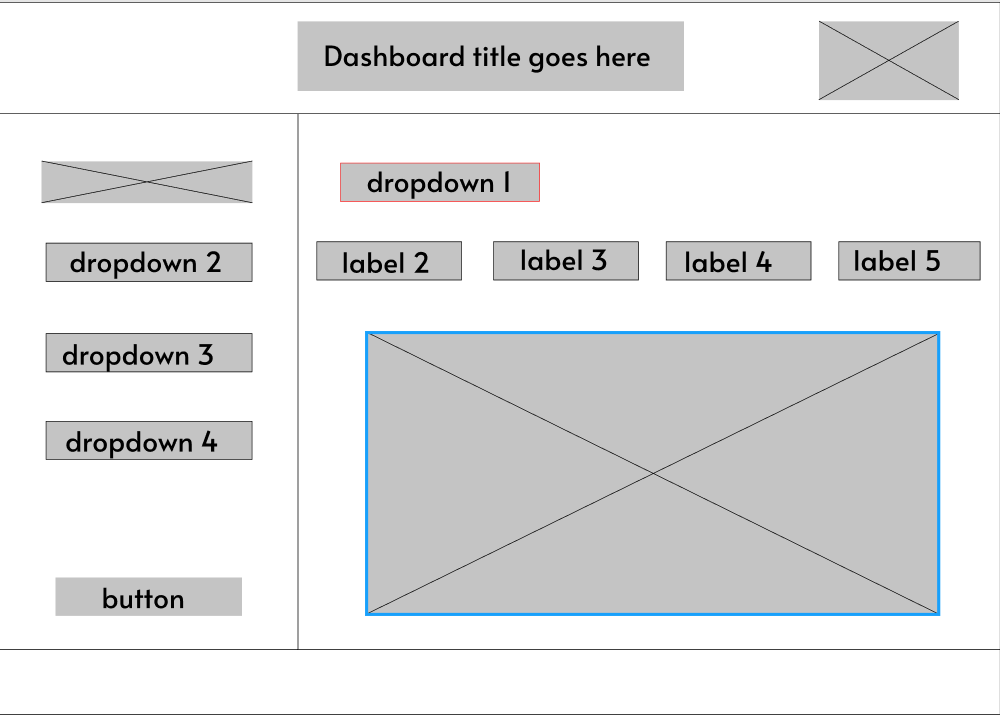

# Design Milestone

## Problem Statement
Engineering managers routinely have to make decisions about setting goals, allocating tasks, prioritizing and deprioritizing work items, all the time while ensuring deadlines and code quality standards are met. Every successful manager identifies choke points in the development process and implements ways to optimize. These choke points can include inefficient team management, piling technical debt, inaccurate requirement understanding, etc. Identifying a choke point is the first step to optimization. However, most project management tools like Jira, Azure DevOps, GitHub offer limited aggregated metrics out of box that can help the manager make intelligent decisions on optimizing project delivery. 

We aim to create a bot that given an individual's GitHub credentials, can display metrics such as bugs per milestone, number of long running issues, employee task allocation and more in a single interactive dashboard. We believe that using the data displayed on the board, the manager will be empowered to make better decisions for project management.

## Bot Description

Our graphics bot is called "Janet". Once Janet is up and running, the user will have to enter their GitHub credentials and log into their account in order to access their repositories. Janet will then display a dashboard that is representative of the current status of all projects, tasks, issues, commits, push/pull requests and various other updates in the repository.
    
Some of the key visuals of the dashboard are:
* Using a Link-types graph to  show push/pull/commits of a particular project.
* Using horizontal grid-axis graphs to show a track-like-progress of projects, on a lower level keep track of the progress of tasks and issues in the projects which collectively build towards completion of the project.
* Using a collapsible tree to see the division of tasks and issues of a project.
* Using a pie chart representation to display the contribution of each collaborator part of a project. 
    
This dashboard will automatically refresh at frequent intervals to ensure that the manager is always receiving the most up-to-date information.

## **Use cases**
_________________
### 1. Viewing the visualizations prepared by the bot.
____________

1.1 Preconditions

The user needs to have valid credentials to login to the GitHub platform. He must have at least one active repository. 

1.2 Main Flow


This use case begins with the user navigating to our website. The user authenticates with her github credentials [S1]. The user is now on the landing page. On the landing page the user sees a large canvas with the default visualization and several controls to change the visualization and its input data. The user has the following control based actions available:

1] Use tab controls to switch between predefined visuals.[S2] 

2] Using a dropdown to cycle between periods for the data in the visual. [S3]

3] Dropdown to change the current repository.

1.3 Subflows

S1 Check Credentials: 

If the user is not already github authenticated they are prompted to enter their credentials. Using Github SSO. If the user has an existing session with github, the token is reused.

S2 Visual Switching:

The user has 4 different buttons (tabs) marked that the user clicks to display different visuals.

Tab 1 (default) - Pie chart visual showing number of issues completed by the contributor.

Tab 2 - Horizontal clustered bar graph denoting (total bugs, bugs open, bugs closed) for each milestone.

Tab 3 - A stacked column bar graph showing a number of different types of issues (documentation,testing,feature,bugs,etc) for each milestone.

Tab 4 - A carousel of cards showing all contributors, contributions(tasks completed), tasks pending, Pull requests raised and Pull requests reviewed.

S3 Time Intervals: 

The user has 4 different time intervals they can choose from:

- Two-week interval (1-15th, 15th-end of the month)
- Month interval (current month)
- Quarter interval (current quarter)
- Year interval (current year)

Changing the value will update the input data of the visuals.

1.4 Alternative flows:

[E1] User's login fails and she is re-prompted to enter correct credentials
______
### 2. Creating and viewing custom visuals.
____________

2.1 Preconditions

The user needs to have valid credentials to login to the GitHub platform. He must have at least one active repository. 

2.2 Main Flow

This use case begins with the user navigating to our website. The user authenticates with her github credentials [S1]. The user is now on the landing page. On the left side of the landing page , the user sees a panel that contains several controls to generate a custom visual.

1] The first control selects the type of visual. Allowed types are (pie chart, bar chart ,line graph).

2] The second dropdown allows the user to select a dimension for the visual. Available dimensions:

-User

-Pull requests

-Issue

3] Depending on which dimension is selected, the user can select from several measures from a third dropdown.

Example: Users: issue count, pull request count, pull request review count, bug count.

4] User will see a button to generate the visual.

**Each control will be disabled until the previous one is filled.**

5] User now can click on the button to save the visual.

Note : The main flow describes how the user chooses a visual based on the parameters available. Clicking on the "generate" button will display the visual on the right side of the page and clicking on the button "save" will save the visual.

2.3 Subflows

S1 Check Credentials: 

If the user is not already github authenticated they are prompted to enter their credentials. Using Github SSO. If the user has an existing session with github, the token is reused.

2.4 Alternative flows:

[E1] User's login fails and she is re-prompted to enter correct credentials.
______________________
### 3. Viewing and Editing an existing saved visual.
________________________

3.1 Preconditions

The user needs to have valid credentials to login to the GitHub platform. He must have at least one active repository. The user should have some visuals that are saved. 

3.2 Main Flow

This use case begins with the user navigating to our website. The user authenticates with her github credentials [S1]. The user is now on the landing page. On the left side of the landing page , the user sees a panel with an option to view an existing visual. 

The user also sees a button "load" to load that particular visual. After loading the visual the user can edit it by following the flow as in use case 2, the only difference being that the dropdown is pre-populated with the visuals' originally selected parameters.

3.3 Subflows

S1 Check Credentials: 

If the user is not already github authenticated they are prompted to enter their credentials. Using Github SSO. If the user has an existing session with github, the token is reused.

3.4 Alternative flows:

[E1] User's login fails and she is re-prompted to enter correct credentials.
________________
### 4. Creating and Viewing Snapshots.
_______________________

#### **Snapshot:** By taking a snapshot we mean to save a read- only record of the current visual and it's data, that can be retrieved for future reference.
(This is similar to taking a screenshot)

4.1 Preconditions

The user needs to have valid credentials to login to the GitHub platform. He must have at least one active repository. 


4.2 Main Flow

This use case begins with the user navigating to our website. The user authenticates with their github credentials [S1]. The user is now on the landing page. The user clicks the "snapshot" button to save the current visual and it's data which is visible on the canvas.

The user has a dropdown feature available to her from which she can select a snapshot to view. By selecting the snapshot and clicking on the load button.

Once the visual has loaded in the canvas, the button changes to "unload" and all the other controls are disabled. Clicking the unload button removes the snapshot and the canvas returns to its original state before the snapshot was loaded. In this way the user can select different snapshots to load.

4.3 Subflows

S1 Check Credentials: 

If the user is not already github authenticated they are prompted to enter their credentials. Using Github SSO. If the user has an existing session with github, the token is reused.

4.4 Alternative flows:

[E1] User's login fails and she is re-prompted to enter correct credentials.


## Design Sketches 

### Wireframe for Janet 



### Storyboard for Janet


## Architecture Design

### High-level diagram


Overall, the project is a website that allows users to view metrics about their git repositories. As per the diagram we've split the architecture into 3 parts for convenience:
1. **Client Side**:
We intend to use React as the front-end framework of choice. Given that we will be implementing custom visuals, React offers a lot of helpful features out of the box that are especially good for handling user interaction and state management.
For creating the visuals themselves, we will be using AirBnB's VisX library. The VisX library is an open-source React wrapper on the well-known D3.js library, with some added effects by the AirBnB developers. The reason for choosing this is because it offers a high degree of customization compared to other visual libraries, and the learning curve is not as bad as with D3.js. We intend to use the individual components present in the library collectively to make our own visuals. Depending on the performance of the website and development cost, we may consider using Redux to get a single payload on site load and then reuse the data across components.
The website as a whole will be using Bootstrap as the overall standard for writing front-end code. 
2. **Server Side**:
The server side is going to be a straightforward expressjs server. There is a chance that this might change to Java or .NET depending on what's more convenient to host, but overall the job of the server is simply going to be to retrieve data from the Git APIs with minimal data cleaning, and to store data in the database. The aggregation and formatting is going to be done client side.
3. **Authentication/Authorization**: We will use OAuth 2.0 token authorization with GitHub to get the repositories and their data that the user has access to.
4. **Cloud Services**: Primarily two cloud services will be used: Azure AppService and Azure Blob Storage. Blob storage is the cheapest option available to store NoSQL data. Since we do not need the advanced querying features of Mongo DB or Cosmos DB, this fits our needs perfectly.

### Data Management
Each user will have a blob associated with him/her. The blob name will correspond to the user unique ID. The models for the user, custom visuals, and snapshots are saved as follows:

**User:**
```json
{
    "user": {
        "userId": "string",
        "visuals": "Visual[]",
        "snapshots": "Snapshot[]",
    }
}
```

**Visual:**
```json
{
    "visual": {
        "id": "string",
        "name": "string",
        "visual_type": "int",
        "axes": {
            "x": "string[]",
            "y": "string[]",
        }
    }
}
```

**Snapshot**:
```json
{
    "snapshot": {
        "id": "string",
        "name": "string",
        "visual_type": "int",
        "data": {
            /*Custom structure*/
        }
    }
}
```

### Authentication
Only the WebApp server will be able to access the blob storage. This prevents the data store endpoint from being exposed to the client. The WebApp will authenticate using a managed identity which will be configured on the Azure Portal.

### Additional Considerations

#### Accessibility
We plan to use Microsoft's Accessibility Insights tool. (Just the fast pass). This tool identifies issues like color contrast, missing aria labels and alt text, incorrect usage of HTML tags, "tab traps" and so on. If time permits, we may add additional testing using Windows Narrator to ensure people with impaired vision can navigate the page.

#### Assumptions
We make the following assumptions regarding the team project management:

1. Users are using GitHub's out of box labels for identifying tasks - bug, feature enhancement, documentation, etc.
2. Work items generally follow this structure:


