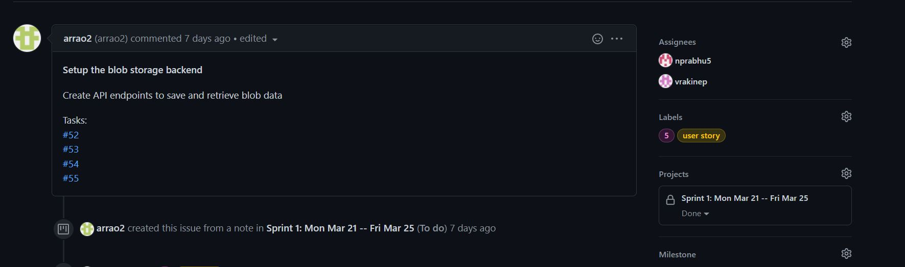
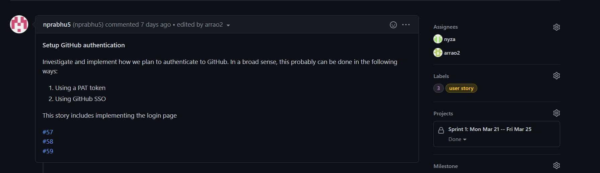
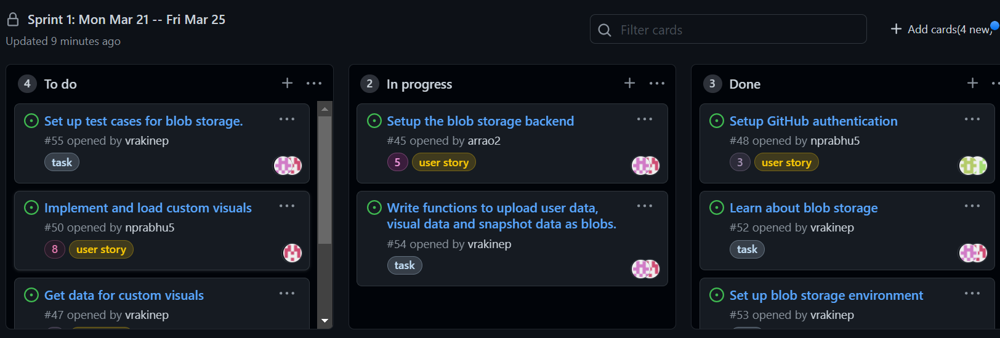
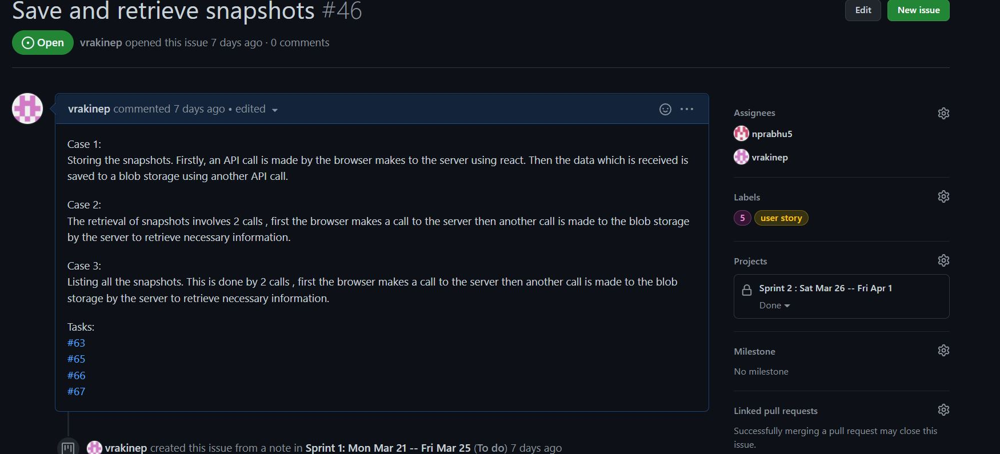
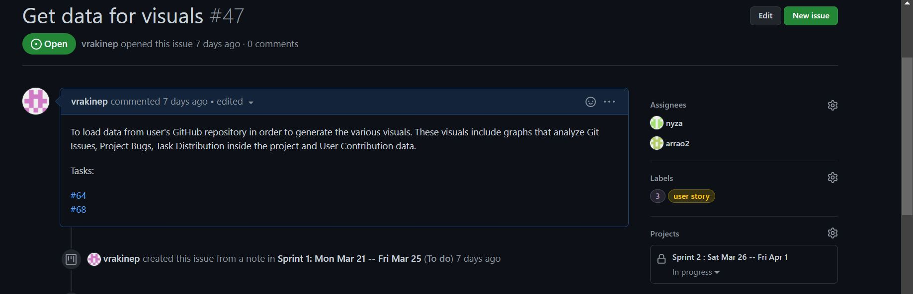
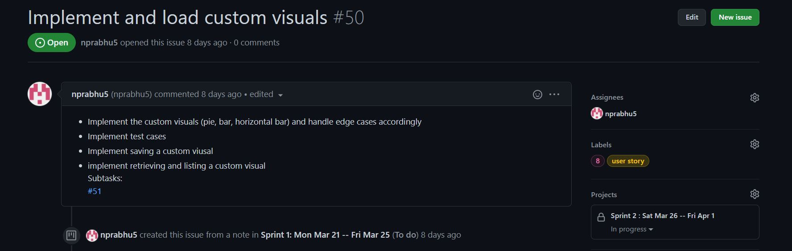
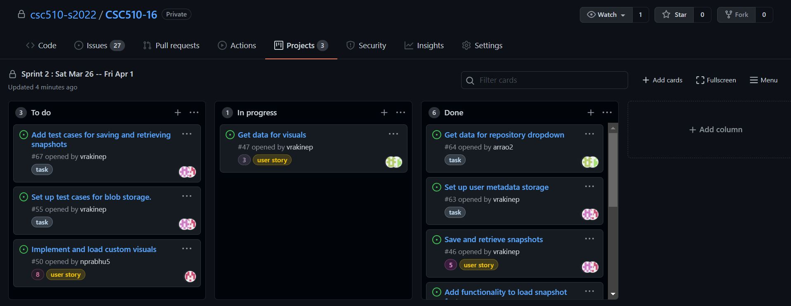
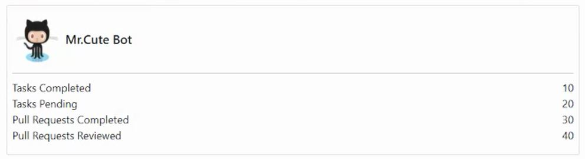
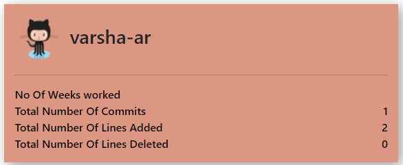

# Milestone: PROCESS

# Sprint 1: Mon Mar 21 -- Fri Mar 25
## Process
We aim to complete the functionality for The visualization BOT - Janet by the end of sprint 2.
For sprint 1 we have decided to work on two user stories, they are: 
1. **Setup the blob storage backend** with story points : 5.
2. **Setup GitHub authentication** with story points : 3.

This is a screenshot of how the user story looks with the story points (visible as labels), Assigned by and Assignees:

 

_________________________
## Practices

<u>Core Practice:</u>

We have decided to integrate Pair Programming practice with our current development. For sprint 1, the pairs that are working together are:

Neil and Varsha (Driver: Varsha, Navigator: Neil)

Nishitha and Anisha (Driver: Nishitha, Navigator: Anisha)

We plan to interchange the roles of the Driver and the Navigator in Sprint 2.

<u>Collary Practices:</u>

1. **Incremental Development** - Depending on the user story that is being worked on each pair of developers are developing and deploying only one main functionality on the landing page. For example: Developers are working on the functionality of a single tab and deploying the changes before moving onto the next tab. The tabs for viewing the visualizations offered by the BOT look like this:

This method is being followed to reduce risks and the margin for merge conflict errors. We have adopted this practice as we have faced merge conflict errors in the past.

2. **Shared Code**- To improve efficiency, we are allowing any developer to pull the most recent changes and change code whenever needed. Once changes have been made, their pull request will be reviewed by the other members of the team and merged accordingly.
_______________________________
## Iteration Worksheet

Find the Link to our worksheet.md file here -> [WORKSHEET.md](/WORKSHEET.md)

We have maintained this iteration worksheet for both sprints

## Status of Kanban Project Board

* <u>Completed Tasks:</u> 

    As of the end of Sprint 1, we have completed setting up GitHub authentication for the user and we have set up the backend blob storage environment. We have also added the functionality of uploading user data, visuals and snapshots as blobs to our backend storage. 

* <u>Incomplete Tasks:</u>

    We are yet to finish building test cases for the blob storage and plan to push this task for the next sprint.
    
* <u> Future Tasks:</u>
    
    For the next sprint, we plan to complete the other  user stories- Implement and load custom visuals, implement the functionality for saving and retrieving the custom visuals and snapshots to and from the blob storage. 
_________________________
## Minutes of Meeting
_________________
### Meeting-1
____________________
### <u>Call to order</u>
A meeting of CSC 510-s2022/CSC 510-16 was held virtually on Zoom on 24th March 2022.
### <u>Attendees</u>
Attendees included Anisha Rao, Neil Prabhu, Varsha Akinepalli and Nishitha Yza.
### <u>Agenda:</u>
•	To discuss status of Sprint 1.

•	Decide on Action Items for this Sprint.
### <u>Reports</u>
Discussed the status of progress with current sprint:

•	Finalized the user stories and tasks for each user story. 

•	Assigned developers for each user story. 

### <u>Action Items:</u>
1.	Update Kanban board with user stories, tasks and assign them to developers.
2.	Learn about blob storage, GitHub authentication.
3.	Complete user stories and it’s linked tasks by the end of sprint.
_____________________________
## Process Reflection for Sprint 1
* Although during the beginning of the sprint our development work was slow, we picked up pace and completed the user stories for the required sprint as desired.
* Working in pairs and implementing pair programming practices proved good results.
* Merge conflicts were causing some problems but we are working on that by implementing incremental development.

_________________________

# Sprint 2 : Sat Mar 26 -- Fri Apr 1
## Process
Continuing our dev work on the Graphics BOT we have decided to work on these user stories this sprint: 
1. **Get data for visuals** with story points : 3.
2. **Save and retrieve snapshots** with story points : 5.
3. **Implement and load custom visuals** with story points :8.

This is a screenshot of how the user story looks with the Assigned by and Assignees:

 

## Practices

<u>Core Practice:</u>

We have decided to integrate Pair Programming practice for this sprint as well. 

We have interchanged the roles of the Driver and the Navigator in Sprint 2 as compared to Sprint 1.

<u>Collary Practices:</u>

We have followed the same Incremental Development practice as Sprint 1. We have also continued to implement shared Code practices. Any changes made by developers are first addressed by reviewing pull requests, once that is sorted the developer's branch is merged with the dev branch.

## Iteration Worksheet

Updates for Sprint 2 have been logged in worksheet.md,  file here -> [WORKSHEET.md](/WORKSHEET.md)

We have maintained this iteration worksheet for both sprints

## Status of Kanban Project Board

* <u>Completed Tasks:</u> 

    We have completed setting up the functionality for saving and retrieving snapshot data as well as getting data for visuals. 

    * We have implemented custom visuals as a part of this sprint as well.

    * We have made a minor change to the result tab 4 is going to display. The user card used to look like this:

    

    * Now the user card looks like this:

    

* <u> Incomplete Tasks:</u>

    We have to work on loading custom visuals which is a part of the user story : Implement and Load Custom Visuals. We also have to set up test cases for blob storage.

_________________________
## Minutes of Meeting
_________________

### Meeting-2
____________________
### <u>Call to order</u>
A meeting of CSC 510-s2022/CSC 510-16 was held in person on 25th March 2022.
### <u>Attendees</u>
Attendees included Anisha Rao, Neil Prabhu, Varsha Akinepalli and Nishitha Yza.
### <u>Agenda:</u>
•	To complete user stories assigned for developers.

### <u>Reports</u>
Discussed the status of progress with current sprint:

•	To finish 2 user stories : Setup the blob storage backend and Setup GitHub authentication. 

### <u>Action Items:</u>
1.	Finished 2 user stories : Setup the blob storage backend and Setup GitHub authentication. 
2.	Updated Kanban Board by moving the necessary user stories to "Done".

_________________________
### Meeting-3
____________________
### <u>Call to order</u>
A meeting of CSC 510-s2022/CSC 510-16 was held in person on 27th March 2022.
### <u>Attendees</u>
Attendees included Anisha Rao, Neil Prabhu, Varsha Akinepalli and Nishitha Yza.
### <u>Agenda:</u>
•	To complete user stories assigned for developers.

•	To complete tasks linked to user stories.

### <u>Reports</u>
Discussed the status of progress with current sprint:

•	To start work on the two user stories pending for sprint 2.

### <u>Action Items:</u>
1. Made some minor changes to the Blob storage user story.
2. Made some changes to the javascript files in the project that occurred due to merge conflicts.
3. Started work on pulling repository data from GitHub, user story - Get data for visuals.
4. Updated Kanban Board by moving the necessary user stories or tasks to "Done".

_________________________
### Meeting-4
____________________
### <u>Call to order</u>
A meeting of CSC 510-s2022/CSC 510-16 was held in person and on zoom on 29th March 2022.
### <u>Attendees</u>
Attendees included Anisha Rao, Neil Prabhu, Varsha Akinepalli and Nishitha Yza.
### <u>Agenda:</u>
•	To complete user stories assigned for developers.

### <u>Reports</u>
Discussed the status of progress with current sprint:

•	Work on and finish the two user stories pending for sprint 2.

### <u>Action Items:</u>
1. Finished user story - Save and retrieve snapshots. 
2. Pulled issue related data from github for user story - Get data for visuals.
3.  Updated Kanban Board by moving the necessary user stories or tasks to "Done".

_________________________
### Meeting-5
____________________
### <u>Call to order</u>
A meeting of CSC 510-s2022/CSC 510-16 was held in person on 31st March 2022.
### <u>Attendees</u>
Attendees included Anisha Rao, Neil Prabhu, Varsha Akinepalli and Nishitha Yza.
### <u>Agenda:</u>
•	To complete user stories assigned for developers.

### <u>Reports</u>
Discussed the status of progress with current sprint:

•	Work on and finish the user stories pending for sprint 2.

### <u>Action Items:</u>
1. Finished the user story for :Get data for visuals.
2. Started work on implementing Custom visual data.
3. Improved visuals for user cards under tab 4.
4. Showcased out BOT for TA demo.
5.  Updated Kanban Board by moving the necessary user stories or tasks to "Done".
_____________________________
## Process Reflection for Sprint 2
* We are happy with our progress during this sprint. 
* We were able to realize every team members weaknesses and strengths with respect to code development.
* We are on the road to improve our GitHub software skills. 
__________________________
__________________________
### DEPLOY SPRINT
____________________________
### Minutes of Meeting
_________________________
### Meeting-6
____________________
### <u>Call to order</u>
A meeting of CSC 510-s2022/CSC 510-16 was held  on zoom on 11th April, 2022.
### <u>Attendees</u>
Attendees included Anisha Rao, Neil Prabhu, Varsha Akinepalli and Nishitha Yza.
### <u>Agenda:</u>

To discuss and divide up the initial tasks for deployment.

### <u>Action Items:</u>
- Create ARM templates for deployment: assigned to vrakinep and nprabhu5
- Set up GitHub actions runaround VCL: assigned to nprabhu5 and arrao2

### Meeting-7
____________________
### <u>Call to order</u>
A meeting of CSC 510-s2022/CSC 510-16 was held in person on 13th April 2022.
### <u>Attendees</u>
Attendees included Anisha Rao, Neil Prabhu, Varsha Akinepalli and Nishitha Yza.
### <u>Agenda:</u>
To discuss the status of the previous meeting action items.

### <u>Action Items:</u>
- Start build phase for deployment: assigned to nyza and vrakinep
- Implement ARM phase: assigned to vrakinep and nyza

### Meeting-8
____________________
### <u>Call to order</u>
A meeting of CSC 510-s2022/CSC 510-16 was held in person on 15th April 2022.
### <u>Attendees</u>
Attendees included Anisha Rao, Neil Prabhu, Varsha Akinepalli and Nishitha Yza.
### <u>Agenda:</u>
To discuss the status of the previous meeting action items and bugs found in the project.

### <u>Action Items:</u>
- Implement publish phase: assigned to arrao2 and nprabhu5
- Fix browser reload functionality after saving visuals and snapshots: assigned to arrao2 and vrakinep

### Meeting-9
____________________
### <u>Call to order</u>
A meeting of CSC 510-s2022/CSC 510-16 was held in person on 17th April 2022.
### <u>Attendees</u>
Attendees included Anisha Rao, Neil Prabhu, Varsha Akinepalli and Nishitha Yza.
### <u>Agenda:</u>
To discuss the status of the previous meeting action items and set up server side test cases.

### <u>Action Items:</u>
- Set up test cases for saving and viewing snapshots: assigned to vrakinep and nprabhu5.
- Set up test cases for saving and viewing custom visuals: assigned to nyza and nprabhu5.