# REPORT

## What Problem does Janet Solve?

Any software engineering task requires decisions to be made about setting goals, allocating tasks, prioritizing and deprioritizing work items. These tasks have to be managed ensuring that deadlines are met and company standards are met. Every successful manager identifies choke points in the development process and implements ways to optimize. These choke points can include inefficient team management, piling technical debt, inaccurate requirement understanding, etc. Identifying a choke point is the first step to optimization. However, most project management tools like Jira, Azure DevOps, GitHub offer limited aggregated metrics.
 
Our Bot - JANET can display metrics such as bugs per milestone, issues allocated to each contributor in a project, number of commits made by contributors and also offers a customization panel that allows users to create their own visuals, all on a single interactive dashboard. We believe that using the data displayed on the board, any manager will be empowered to make better decisions for project management.

______________________________________________________________________________________________
## Primary features and screenshots of the Janet Bot

In order to use our bot one has to visit : [Link](https://janetprod.azurewebsites.net)

The user must login using their GitHub credentials. On the landing page the user is first prompted to select which repository they want to generate visuals for using the "Select Repository" dropdown.
  
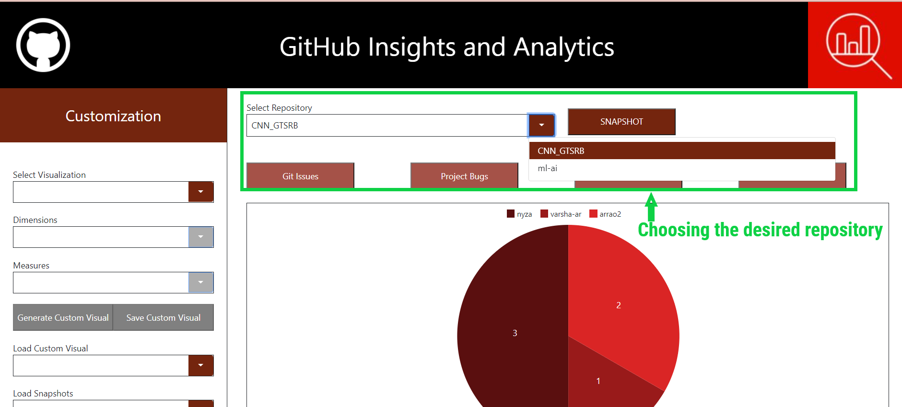

All visuals/graphics that this bot has / will generate are visible in the visual area , which is located in the center of the website.

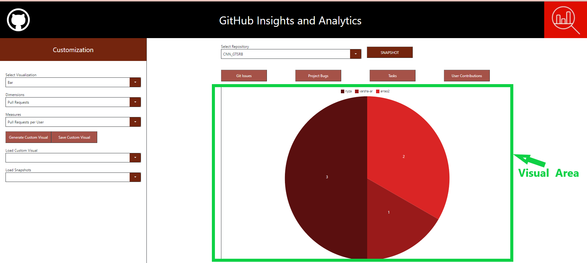

### **1. Available Visuals**
The user can click on any one of the following four tabs for viewing the graphs that have been generated by our bot. 

Tab 1 : <u>Git Issues</u>

On clicking this tab the user is able to see a pie chart with the number of issues assigned to each user. There is also a legend on the top of the graph giving details about the various contributors.

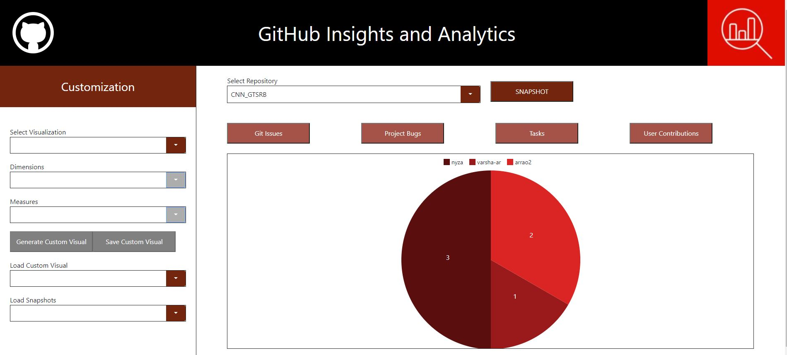

Tab 2 : <u>Project Bugs</u>

On clicking this tab the user is able to see a horizontal clustered bar graph. The graph has information of the status of bugs in a current project based on the milestone. Each milestone has 3 bar graphs, first one indicating the number of open bugs, second indicating the number of closed bugs and last one for keeping a count of the total number of bugs. There is also a legend included which helps the user to distinguish between the bars. As an additional feature we can also make the graph informative by displaying the exact count of bugs on a certain bar when a user hovers over it.

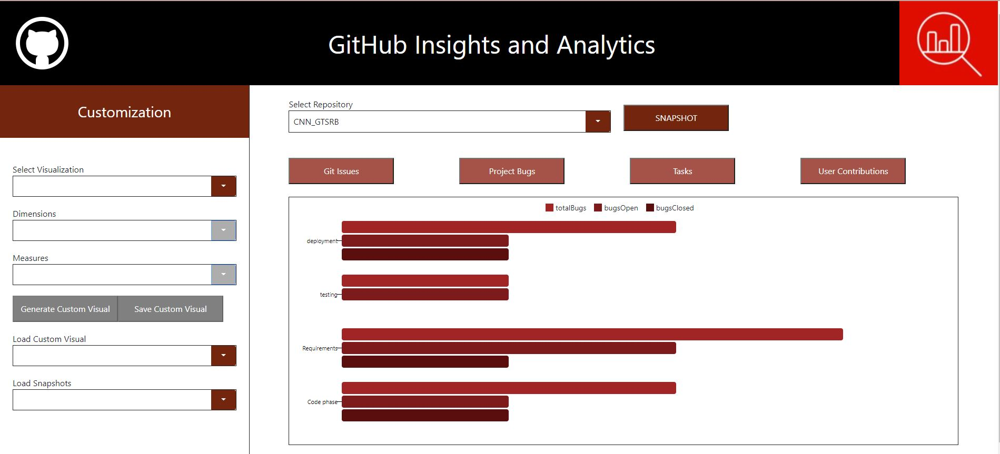

Tab 3 : <u>Tasks </u>

On clicking this tab the user is able to see a stacked column bar graph indicating the various tasks in a particular milestone. The various stacks are created based on the type of task that is allocated to a milestone; this could be tasks with different labels like enhancement, won't fix , documentation, etc. There is a legend on top of the graph giving more information about each stack. As an additional feature we have also made the graph informative by displaying the exact count of tasks on a certain bar when a user hovers over it.

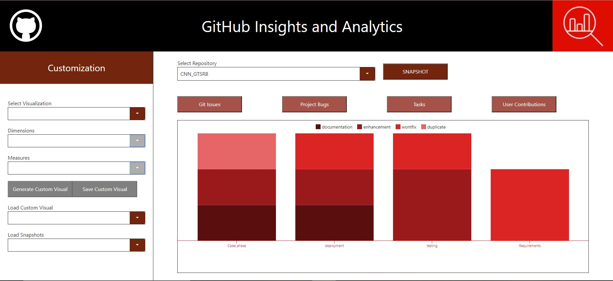

Tab 4 : <u>User Contributions </u>

On clicking this tab the user is able to see a carousel of cards showing all contributors, contributions(tasks completed), tasks pending, Pull requests raised and Pull requests reviewed.various details about all the contributors of a project. These details include the Number Of Weeks Worked, Total Number Of Commits, Total Number Of Lines Added and Total Number Of Lines Deleted. user cards by default use the Octocat image if a user does not have a profile picture on GitHub.

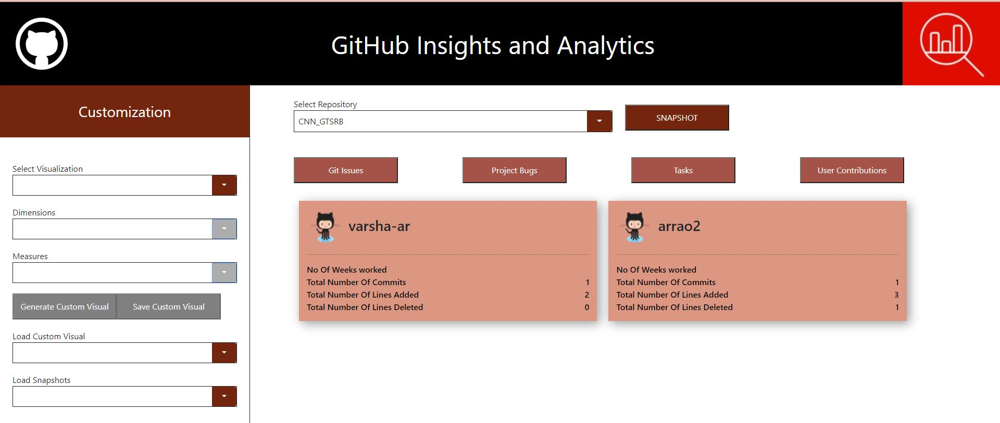

### **2. Custom Visuals**

The left-hand panel of the Janet Bot website is called "Customization". This panel has features that allow users to create their visuals.
Users can follow these steps to generate custom visuals: 
Select type of graph from visualization dropdown such as pie and bar 
Select type of metric from the Dimensions dropdown such as no of issues or pull requests 
 
* If the user chooses no of Issues for the dimension then under the Measures dropdown the user can choose between :
- Issues per Milestone
- Issues per Label
- Issues per Status
 
* If the user had selected Pull Requests under dimensions then under the Measures drop down the user can choose between :
- Pull Requests per User
- Pull Requests per Milestone.
 
Once the user is happy with their selection they click on the "Generate Custom Visual" button. This will generate the desired visual and display it in the visual area.

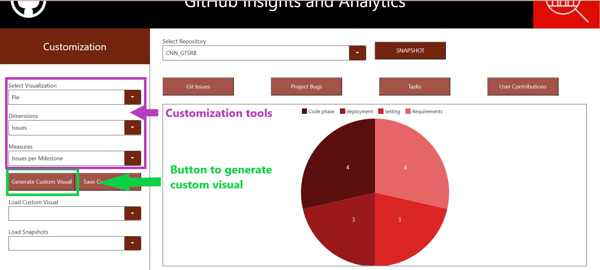

Another feature that is available in the customization panel is the "Save Custom Visual" button. If the user wishes to save the graph that they created they can do so by clicking on this button. These visuals are stored with a timestamp as their name.

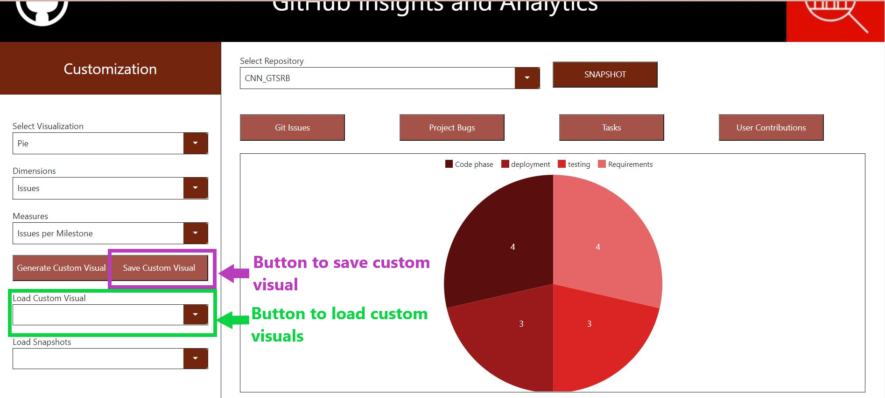

Screenshot of how the load custom visual dropdown looks:

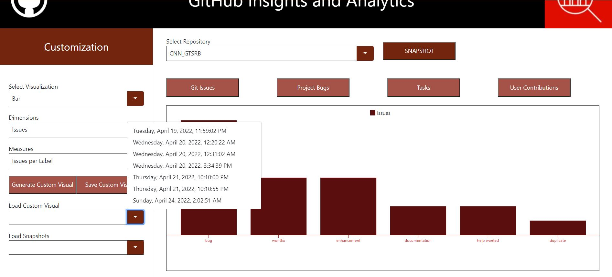

### **Here are some custom visuals generated by a user:**

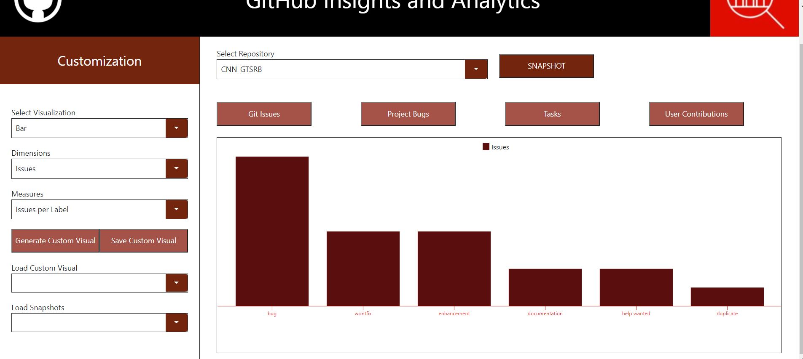

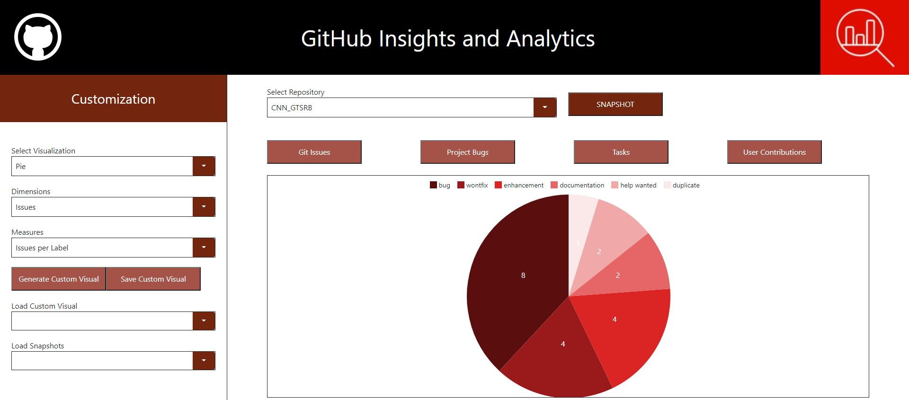

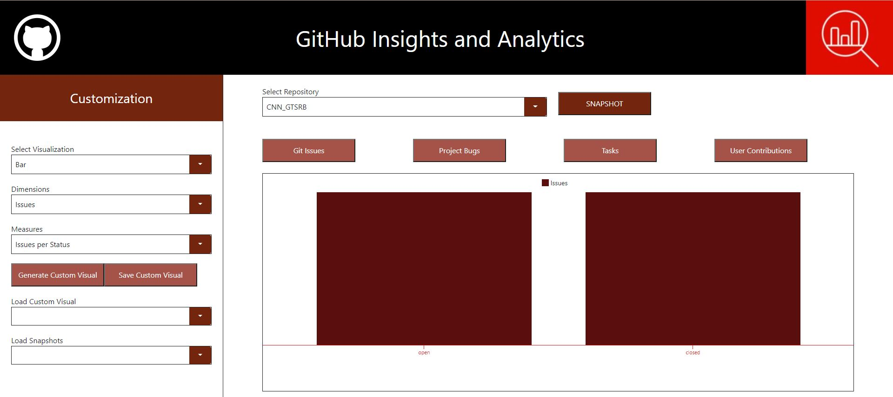

We have linked our Bot to communicate with our cloud database - Azure Blob Storage to save and retrieve any visuals that are saved by the user. Using the "Load Custom Visual" dropdown, the user can access any visual that they have saved. The same technology was used for "snapshot" as well which is discussed in the next point.

### **3. Snapshot**

Just beside the "Select Repository" dropdown is the "Snapshot" button. This button allows a user to take a snapshot of any visual that is present in the visual area. By clicking on the snapshot button the visual gets stored in the database. These snapshots can be accessed anytime by clicking on the "Load Snapshots" dropdown in the customization panel. Snapshots are stored with a timestamp as their name.The snapshot chosen will load in the visual area.

The idea behind including this feature was to enable a user to measure the progress/ activity over a period of time. This allows users to understand changes visually - making it easier to track progress/activities.

Screenshot of the Load snapshots dropdown:

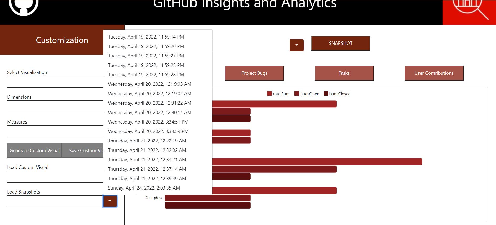
___________________________________________

## Reflection on the development process and project

Our team worked together on deciding how to go about the visual aspects of the BOT. We had several brainstorming sessions to decide on which graphics we wanted to use in the final BOT. We also decided to build this BOT using an interactive UI. The entire design and ideation phase included creating the design architecture with wireframes. We used Figma to create the initial wireframes for the UI. During this phase, we were exposed to several HTML and CSSrelated commands and working principles. This phase helped us understand the working of our BOT on a high-level basis.

We did not face many challenges during the ideation phase since all of us were on the same page as to what the BOT was built to do and how it would look to a user. During the initial BOT development phase and the coding sprints, we realized as a team that each of us had a different skill to bring to the table. Some of us were good with UI and front end, others with Backend and cloud storage and the rest were good with building the React app and handling API calls. We split up our tasks and assigned each developer some issues.

We held scrum meetings to craft user stories from our use cases and assigned story points depending on the efforts required to implement the backlog item. These were some questions we reviewed in every meeting we had :

i) What did you accomplish since the last meeting?

ii) What are you working on until the next meeting?

iii) What is keeping you from doing your task?

 We also updated all the user stories and sub-tasks on the kanban style board. We used GitHub “projects” to monitor these user stories and sub-tasks. We maninted three columns delineating workflow activities: To-Do , In-Progress and Done. Depending on the status of any issue, we moved it according to which column it belonged.

We implemented pair programming and ensured that in the pair, one person was the driver and one person was the navigator during each sprint. Pair programming helped us complete the coding work a bit faster as each developer collaborated well with their partner. This practice also ensured that there were fewer merges to handle. There was a clearer picture of code ownership and allowed mentoring among team members as well. Another practice we implemented was Incremental development. Depending on the user story that is being worked on, each pair of developers took care of developing and deploying only one main functionality on the landing page. 

Every developer had their own branch to track code changes made by them. A “Dev” branch was created to log all the development changes made to the BOT before pushing these changes to “Main”. 
During the coding sprints, we ensure to follow the shared Code software practice. In order to improve efficiency, we allowed any developer to pull the most recent changes and change code whenever needed. Once changes were made, their pull request would be reviewed by the other members of the team and merged accordingly. Since merge conflicts occurred several times, our team went through merge paranoia😧! We were spending a lot of time fixing our merge conflicts and had to decide on a disciplined way of committing changes and creating PRs. To do so we decided that at any time a developer wanted to pull/push changes to the dev branch, the developer needed to pull in the latest version of the dev branch into their local branch before pushing the latest changes to the origin dev branch.

Every single PR review made by the developer was reviewed by two other developers. We included comments on code changes, commenting/removing unnecessary code blocks, gave appreciation using emojis and comments, and ensured all the files being changed were correctly merging into the target branch.

Developers discussed any problems they faced or were facing with tasks during these meetings. Developers were assigned tasks and partners accordingly. Minutes of Meetings were noted for every meeting that occurred during the coding sprints. We used Zoom and Google Meet for our virtual meetings. As a team, we enjoyed working together, and we were open to receiving and giving any constructive critiques. We relied on each other for guidance and support. On a side note, we made good friends and realized our penchant for burritos 🌯💙🌯.

## Limitations and Future Work
______________________
The current visuals and metrics of our BOT are somewhat limited to our domain knowledge of what metrics are useful to project managers. The first future milestone would be to identify new metrics that are actively used in the industry, and implement visuals that can denote them satisfactorily. 

In terms of minor updates, there are several UX improvements that can be made which will greatly enhance user experience. Examples of such improvements include: Adding a dialog which allows users to set the name of the snapshot or custom visual that was created, adding annotations for first-time users explaining how to use the BOT. 

Considering that our project is called “Graphics Bot”, another very important part of future work would be to comply with accessibility standards. While trying to implement it separately, we realized that this involves a lot of rework. Currently the code is mostly accessible, with a need for us to implement a way for users with impaired vision to interpret the visuals using a narrator.

To summarize, we identify the next 4 milestones of the project in order of importance:
1. UX improvements: Add option to delete saved items, option to enter the name of the item before saving, implement a ‘Loader’, other minor improvements.

2. Make application responsive across tablets and cell phone devices.

3. Implement additional custom visuals.

4. Work on accessibility compliance.

## Video Presentation
________________________

Click [here](https://drive.google.com/file/d/1tlPp8rn23qwKrhV7IQvwbiruxnx3a7Ft/view?usp=sharing) to watch our video presentation. We have made a few small changes from the draft video submitted previously and made sure the volume is better this time.
